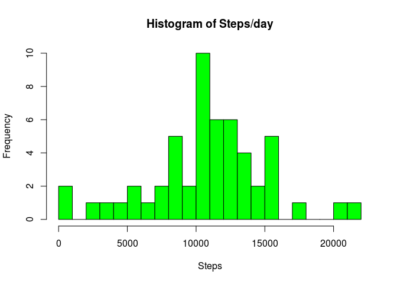
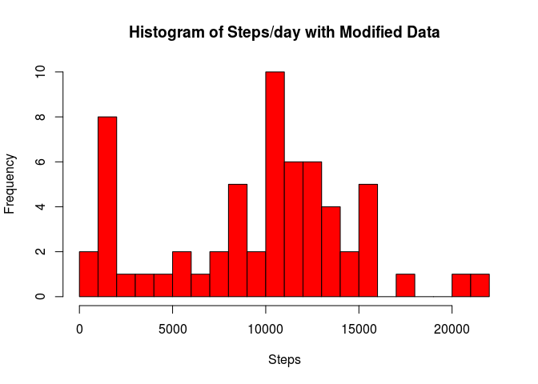

# Reproducible Research: Peer Assessment 1

First, setting up knitr to create "figures" folder and dump all figures into it


```r
require(knitr)
```

```
## Loading required package: knitr
```

```r
opts_chunk$set( fig.path = 'figures/' )
```

## Loading and preprocessing the data
Create a directory for this assignment

```r
localDir <- 'Project1'
if (!file.exists(localDir)) {
        dir.create(localDir)
}
```
Download the activity monitoring data

```r
url <- "https://d396qusza40orc.cloudfront.net/repdata%2Fdata%2Factivity.zip"
file <- paste(localDir,basename(url),sep='/')
if (!file.exists(file)) {
        download.file(url, file,method="curl")
        unzip(file,exdir=localDir)
        }
```
Reading in data from activity.csv file 

```r
Data <- read.csv("./Project1/activity.csv", sep = ",",header=T)
```
## What is mean total number of steps taken per day?
Creating a new data frame to store total steps info


```r
Data[,2] <- as.Date(Data[,2])
SumData <- aggregate(Data$steps ~ Data$date, FUN = sum)
names(SumData) <- c("Date","Steps")
```

Plotting Histogram of steps/day


```r
hist(SumData$Steps, col = "green",breaks=25,main="Histogram of Steps/day",xlab="Steps")
```

 

Reporting the mean and median of total number of steps/day


```r
mean(SumData$Steps)
```

```
## [1] 10766
```

```r
median(SumData$Steps)
```

```
## [1] 10765
```

Mean and median are 10766.19 and 10765 respectively

## What is the average daily activity pattern?
Obtaining dataframe containing average steps for each time interval


```r
AveData <- aggregate(Data$steps ~ Data$interval, FUN = mean)
AveData$TimeOfDay <- strptime(sprintf("%04d",AveData[,1]),"%H%M")
```

Plotting time series plot of the 5-minute interval (x-axis) and the average number of steps taken, averaged across all days (y-axis)


```r
names(AveData) <- c("Interval","Steps","TimeOfDay")
plot(AveData$TimeOfDay, AveData$Steps,type="l", xlab="Time of Day",ylab="Steps")
```

 

Obtaining 5 min interval with maximum number of steps


```r
AveData$TimeOfDay <- gsub("2014-07-20 ","",AveData$TimeOfDay)
AveData$TimeOfDay[which.max(AveData$Steps)]
```

```
## [1] "2014-07-26 08:35:00"
```

The time interval with max. steps is 08:35:00-08:40:00.

## Imputing missing values
Calculating and reporting total number of missing values


```r
sum(is.na(Data$steps))
```

```
## [1] 2304
```

Replacing the NA's with mean value for that interval


```r
NewData <- aggregate(Data$steps ~ Data$interval, FUN = median)
ModDF <- cbind(Data,NewData)
names(ModDF)[5] <- "Median"
ModDF$steps[is.na(ModDF$steps)] <- ModDF$Median[is.na(ModDF$steps)]
```

Plotting Histogram of steps/day with modified data


```r
SumData <- aggregate(ModDF$steps ~ Data$date, FUN = sum)
names(SumData) <- c("Date","Steps")
hist(SumData$Steps, col = "red",breaks=25,main="Histogram of Steps/day with Modified Data",xlab="Steps")
```

 

The missing values have been replaced by the mean of the values of that interval which shows up as a spike in 1000-2000 bin.
This would be expected to reduce the mean but the median would be expected to be largely similar

Reporting the mean and median of total number of steps/day with modified data


```r
mean(SumData$Steps)
```

```
## [1] 9504
```

```r
median(SumData$Steps)
```

```
## [1] 10395
```

The mean and media values are 9504 and 10395 respectively.
The results are as expected


## Are there differences in activity patterns between weekdays and weekends?

Creating a new factor variable in the dataset with two levels – “weekday” and “weekend”


```r
Data$Day <- weekdays(Data$date)
id <- length(Data$Day)
for (i in 1:id){
        if(Data$Day[i] == "Saturday"|Data$Day[i] =="Sunday"){
                Data$DayType[i] <- "Weekend"
        }
        else {
                Data$DayType[i] <- "Weekday"
}
}
Data$DayType <-factor(Data$DayType)
```

Making a panel plot containing a time series plot of the 5-minute interval (x-axis) and the average number of steps taken, averaged across all weekday days or weekend days (y-axis)

```r
AveData <- aggregate(Data$steps ~ Data$interval + Data$DayType, FUN = mean)
AveData$TimeOfDay <- strptime(sprintf("%04d",AveData[,1]),"%H%M")
names(AveData)[3] <- "Steps"
names(AveData)[2] <- "DayType"

par(mfrow = c(2,1))
with(subset(AveData,DayType == "Weekday"),plot(TimeOfDay, Steps, main = "Weekday", xlab = "Time of Day", type = "l"))
with(subset(AveData,DayType == "Weekend"),plot(TimeOfDay, Steps, main = "Weekend", xlab = "Time of Day", type = "l"))
```

 
